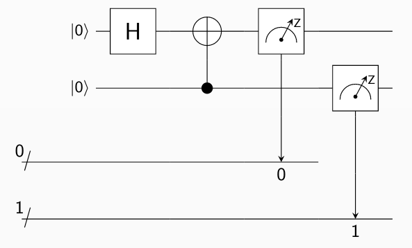

# About Silq

Silq is a new high-level programming language for quantum computing with a strong static type system, developed at ETH Zürich.

# Installation
The official link https://silq.ethz.ch/install has the comands to install in vscode or in linux/Mac Os distributions.

# Bell State

The simplest example for quantum computation is to generate a Bell state from the controlled-not gate to or Cnot with a previous superposition of the qubit and control with the Hadamard gate.



# Program

The silq code to perform the previously mentioned state of bell is described.

```python
// B means the boolea type 
// const mens constant value in this case in the boolean variable x

def cnot(const x:B,y:B):B{ // generate the function Cnot gate
  if x{  // if x is true  apply the sentence inside the {} 
    y := X(y);  // apply X gate in the boolean variable x
  }
  return y; // return the only 
}


def main(){ // main function

  x := false:B;    // A boolean (B type) variable x is initialized in false or zero state (|0>)
  y := false:B;    // A boolean (B type) variable x is initialized in false or zero state (|0>)
  x := H(x);       // Applying Hadamard to the boolean variable x
  y := cnot(x,y);  // It called the function cnot(x,y)
  return  measure(x,y);  // return the measure by the x and y variables or qubits.
}

```

### Expect output

```python
(1,1)
(0,0)
```

A Python file was generated in order to plot the results obtained from the code previously made in silq

```python
import silq as sq

sq.init_variables(n=50,filename="bell_state.sql")
sq.plot_hitogram()

```

{: .center-image }

The previous silq code is in the file called bell_state.sql

And if you want to use the python part to plot the result histogram is the file called silq.py
